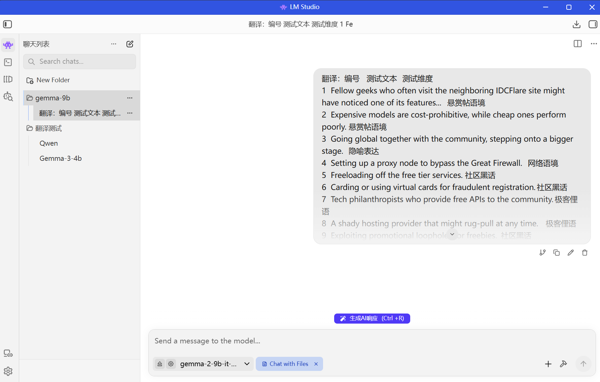
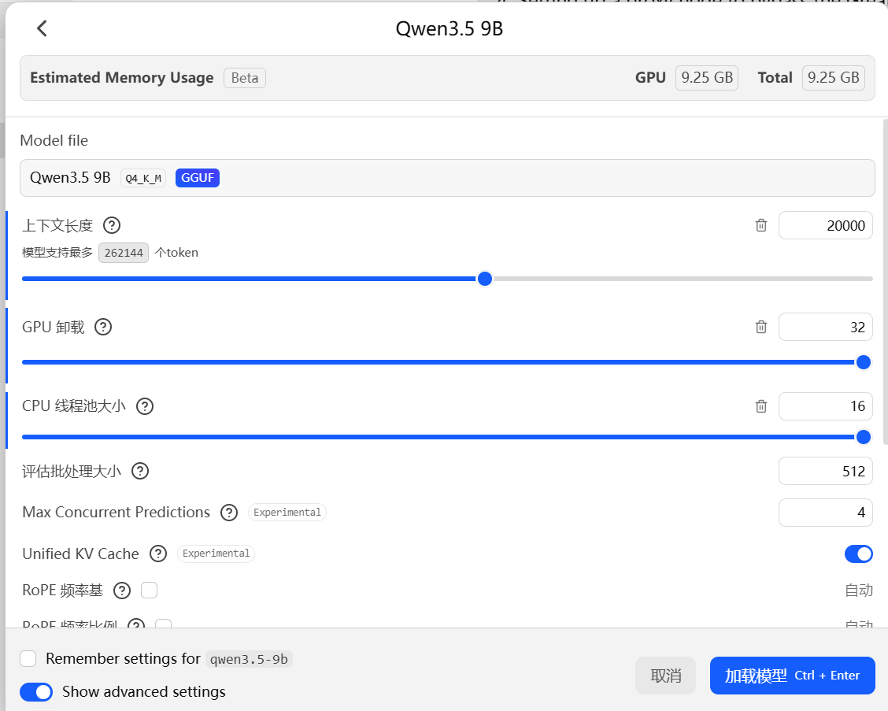
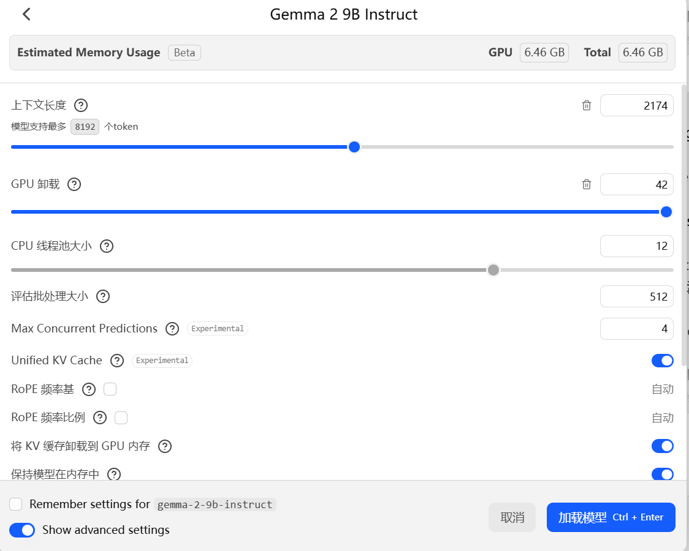
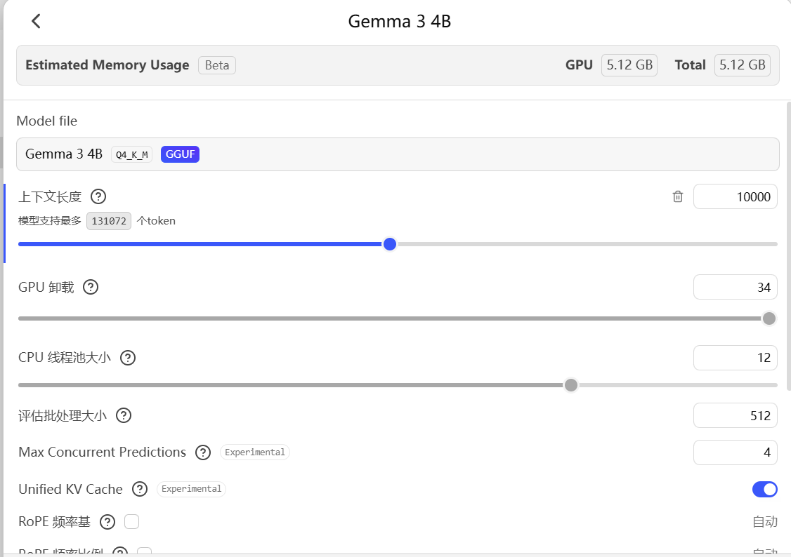
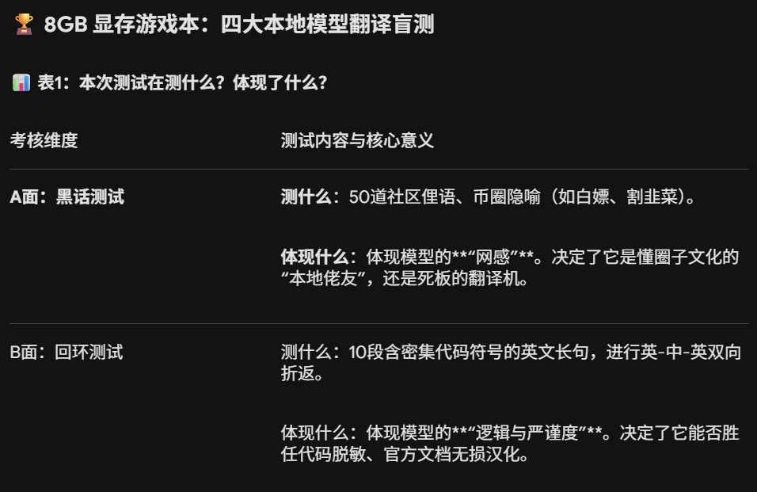
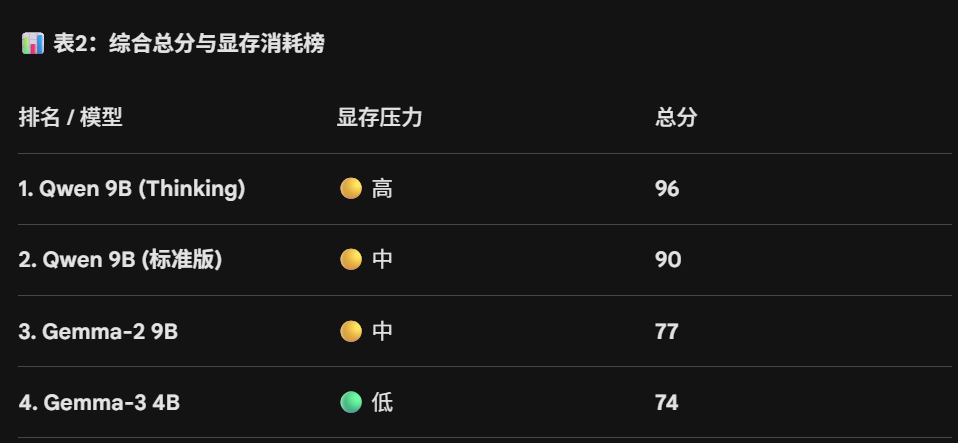
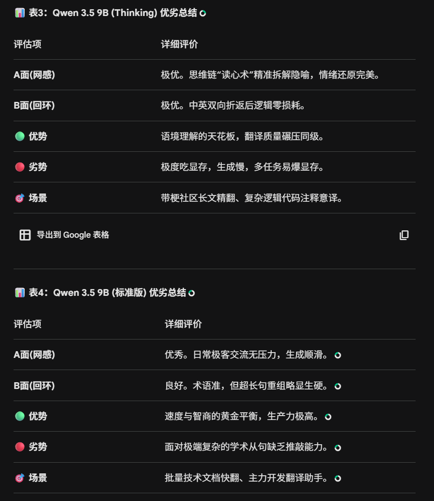
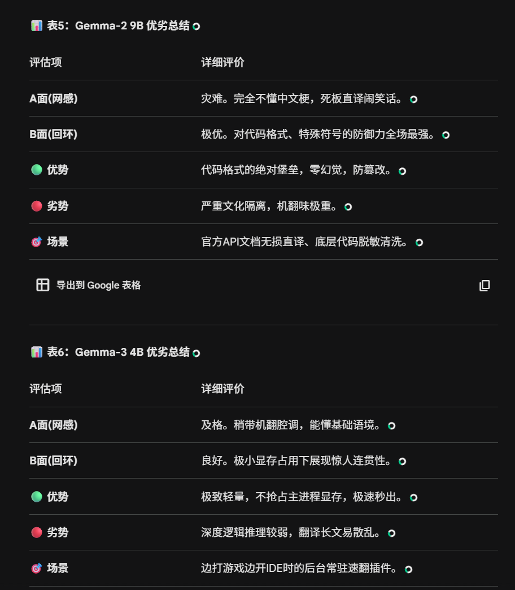

环境：普通笔记本，**RTX 5060 8GB**
任务：把四个开源模型拉到同一套流程里盲测，看看在真实任务里到底能不能用：能不能稳定跑、能不能把话翻明白、能不能在计算机 语境里不掉链子。😋

## 部署与调参（8GB 重点）

推理前端我用 **LM Studio**，底层引擎是 **llama.cpp**。原因很现实：它不是最花哨的，但在本地部署里足够稳，参数开关透明，出问题也容易定位。

在 8GB 显存下，我建议死磕三件事：

1. 9B 模型优先选 **GGUF 的 Q4_K_M**。这档量化通常在 **5.5GB 左右**，8GB 显存里还能硬挤出约 **2.5GB** 给系统开销和 KV Cache。这个空间就是生死线：你有这 2.5GB，模型是“能持续出字”；你没这 2.5GB，就会进入频繁抖动和掉速。
2. **GPU Offload 拉满**。这一步不是“可选优化”，而是必须项。offload 不够时，计算会被迫回流到内存侧做来回交换，显卡和内存互相拉扯，吞吐直接崩。
3. **Context Length 控在 2048 左右**。8GB 下别迷信大上下文，KV Cache 会吃掉你最后的安全余量。你一旦把 Context 开太高，最常见的现象是：刚开始看着还行，几轮后速度从几十 tokens/s 掉到 1 token/s，最后不是卡死就是 OOM。ლ(´ڡ`ლ)

这套参数逻辑说白了就一句话：**先保稳定，再谈上限**。本地翻译是长期活，不是跑一次 benchmark 截图。只要你把显存预算和缓存管理理顺，8GB 平台一样能当生产工具。

模型参数截图放这里：

## 测试维度（数据集由gemini生成）

### A 面：社区黑话与语境

这一面就是看“网感”到底是真有还是装有。技术翻译不怕慢，最怕的是把社区语气翻没了。

我在这组里专门放了诱饵句：当模型面对 `垃圾佬`、`白嫖`、`跑路割韭菜` 这种中文互联网黑话时，它到底是能精准 Get 到情绪和立场，还是会机翻成一本正经的冷笑话？

如果模型只会词典式对齐，你会看到那种“每个词都认识，整句话像外星人发帖”的结果；反过来，网感在线的模型会知道哪里该保留梗，哪里该意译，读起来才像真人在论坛说话。

### B 面：语境回环（英 -> 中 -> 英）

这一面是最残酷的：**A -> B -> A 折返翻译**，专门测信息损耗和结构稳定性。

为什么残酷？因为模型在中英双向切换时，很容易“自作聪明”改写术语。我们重点盯两类风险：

- 术语黏性：`CI/CD pipeline`、`overfitting` 这种词能不能死死咬住，不被改成似是而非的近义表达。
- 结构防御：代码和配置片段会不会被改坏，尤其是 `.yaml` 的缩进、键值层级、标点细节，哪怕只错一个空格，放到真实项目里都可能直接炸。

所以这组不只是测“翻得顺不顺”，而是测“翻完还能不能继续拿去干活”。

## 结果展示（gemini统一评分标准评价，具体的翻译结果见附件）

综合评分与显存消耗：

四个模型的详细评价截图：

## 结论与本地化建议

这轮盲测让我更确定一件事：**8GB 游戏本不需要“万能六边形战士”，需要的是“任务匹配型选手”。**

把模型拟人化一点就很直观了：

- 有的模型像网感点满的“赛博佬友”，混社区、读黑话、接梗快，情绪理解很灵。
- 有的模型像严谨但古板的“学术老实人”，术语稳定、句法工整，适合技术文档和流程文本。
- 还有的模型是后台静默运行的“轻量级刺客”，不抢资源，能长期挂着做基础翻译和清洗。

所以别再问“谁最强”，要问“你今天要干啥”：

- 你要水论坛、看社区讨论，就优先选网感强的。
- 你要洗代码、过配置、做回环校对，就选术语和结构更稳的。
- 你要长时间本地挂任务，就选显存压力更小、输出更稳的。

没有绝对完美的模型，只有合适的工具组合。把它们放在对的位置，8GB 也能打出很高的性价比。😋

---

署名：**Gongyi_Churen**

## 附件下载（DOCX）

- [Qwen 3.5 9B Thinking - 社区短句翻译结果](/posts/files/8gb-translation-test/qwen35-9b-thinking-community.docx)
- [Qwen 3.5 9B Thinking - 回环翻译结果](/posts/files/8gb-translation-test/qwen35-9b-thinking-roundtrip.docx)
- [Qwen 3.5 9B 标准版 - 社区短句翻译结果](/posts/files/8gb-translation-test/qwen35-9b-community.docx)
- [Qwen 3.5 9B 标准版 - 回环翻译结果](/posts/files/8gb-translation-test/qwen35-9b-roundtrip.docx)
- [Gemma-2 9B - 社区短句翻译结果](/posts/files/8gb-translation-test/gemma2-9b-community.docx)
- [Gemma-2 9B - 回环翻译结果](/posts/files/8gb-translation-test/gemma2-9b-roundtrip.docx)
- [Gemma-3 4B - 社区短句翻译结果](/posts/files/8gb-translation-test/gemma3-4b-community.docx)
- [Gemma-3 4B - 回环翻译结果](/posts/files/8gb-translation-test/gemma3-4b-roundtrip.docx)
